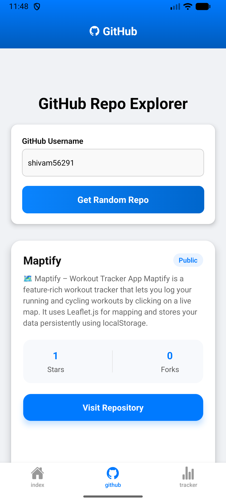
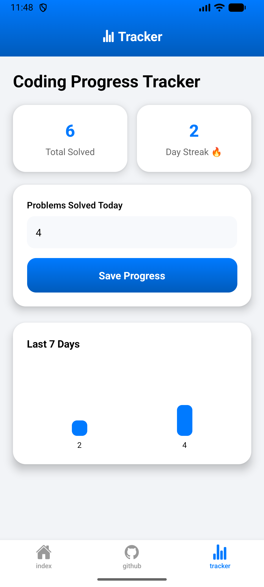
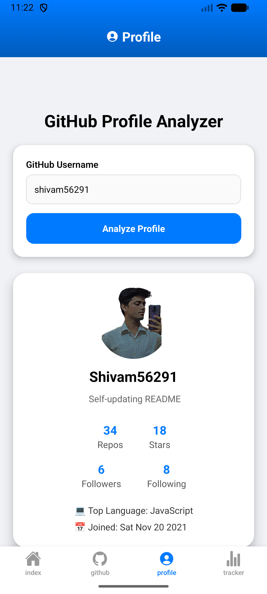

# 🚀 GitHub Random Repo Explorer & Coding Tracker

A modern **React Native (Expo)** mobile application that allows users to:

- 🔎 Explore random public repositories from any GitHub user  
- 📊 Track daily coding progress with streak analytics  
- 🎨 Experience smooth, premium animations across tabs  

Built with **Expo Router**, **AsyncStorage**, and polished UI animations for a clean, production-ready feel.

---

## ✨ Features

### 🔎 GitHub Explorer

- Search GitHub users by username  
- Fetch a **random public repository**  
- View detailed repository information:
  - 📌 Repository Name  
  - 📝 Description  
  - ⭐ Stars  
  - 🍴 Forks  
  - 🔗 Direct GitHub link  
- Smooth animated states:
  - Loading animation  
  - Success animation  
  - Error animation  
- Scrollable result layout for better mobile experience  

---

### 📈 Coding Progress Tracker (New)

A fully functional manual coding tracker:

- ➕ Add daily solved problem count  
- 🔥 Automatic streak calculation  
- 📊 7-day progress visualization  
- 💾 Persistent local storage using AsyncStorage  
- 🧠 Smart date-based tracking (one entry per day)  
- 📦 Clean card-based stats layout  
- ✨ Smooth focus-based screen animations  

---

## 🎬 Premium UI & UX Enhancements

- Animated screen transitions per tab  
- Focus-based animation triggers  
- Micro-interactions on button press  
- Smooth fade, slide, and scale effects  
- Gradient headers  
- Elevated card design with soft shadows  
- Responsive ScrollView layouts  
- Modern mobile-first design approach  

---

## 🧱 Tech Stack

- React Native  
- Expo  
- Expo Router (Tab Navigation)  
- AsyncStorage  
- Lottie Animations  
- React Native Animated API  

---

## 📱 App Structure

app/
 ├── index.tsx        → Home (Welcome + animations)
 ├── github.tsx       → GitHub Random Repo Explorer
 ├── profile.tsx      → GitHub Profile Analyzer
 ├── tracker.tsx      → Coding Progress Tracker
 ├── _layout.tsx      → Tab Layout & Navigation

components/
 └── CustomAlert.tsx

---

## 📸 Screenshots

  
  

  
  

---

## ⚙️ Installation

Clone the repository:

git clone https://github.com/<your-username>/github-random-repo-explorer.git  
cd github-random-repo-explorer

Install dependencies:

npm install

Start the Expo development server:

npx expo start

---

## 🚀 Usage

### GitHub Explorer

1. Enter a GitHub username.  
2. Tap **Get Random Repo**.  
3. View repository details.  
4. Tap the link to open it in your browser.  

### Coding Tracker

1. Navigate to the **Tracker tab**.  
2. Enter the number of problems solved today.  
3. Tap **Save Progress**.  
4. View:
   - Total solved problems  
   - Current streak  
   - Weekly progress graph  

---

## 🎯 Why This Project?

This project demonstrates:

- API integration with GitHub  
- State management in React Native  
- Local persistence with AsyncStorage  
- Streak calculation logic  
- Tab-based navigation with animations  
- Clean UI/UX principles  
- Mobile performance optimization  

Ideal as a **portfolio-ready React Native project**.

---

## 🛠 Future Improvements

- GitHub OAuth login  
- Real chart library integration  
- Dark mode support  
- Cloud sync for tracker data  
- Achievement badge system  
- Calendar-based contribution heatmap  
- Profile analytics tab  

---

## 📄 License

This project is open-source and available under the MIT License.